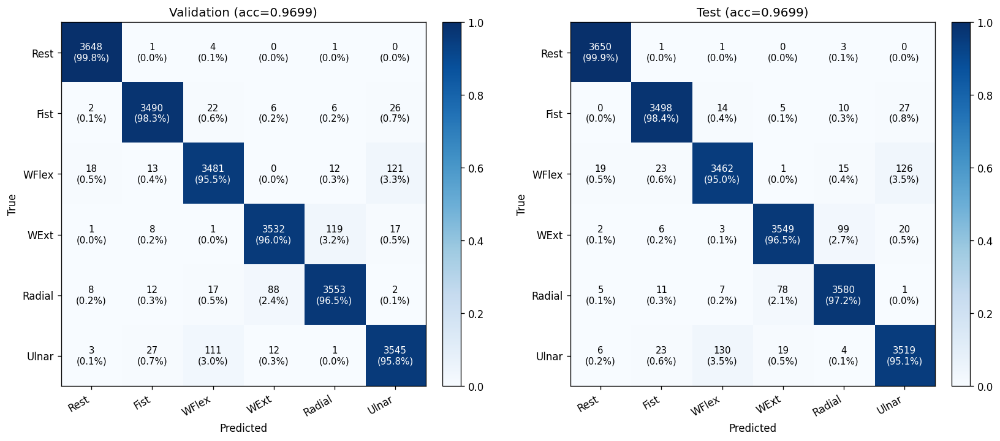

# EMG Gesture Classification (8-channel sEMG → 6 hand gestures)

8채널 표면근전도 (sEMG) 신호로부터 6가지 손동작을 분류하는 파이프라인.
외부 ML 라이브러리(sklearn / PyTorch / TensorFlow) **없이 순수 numpy + OpenBLAS** 로 구현했습니다.

## Result

| Metric | Value |
| --- | --- |
| Test Accuracy | **0.9699** |
| Macro F1 | 0.9700 |
| Train / Val / Test | 102,249 / 21,908 / 21,917 windows |



| Class | Precision | Recall | F1 |
| --- | --- | --- | --- |
| Hand at rest | 0.991 | 0.999 | 0.995 |
| Hand clenched (fist) | 0.982 | 0.984 | 0.983 |
| Wrist flexion | 0.957 | 0.949 | 0.953 |
| Wrist extension | 0.972 | 0.965 | 0.968 |
| Radial deviation | 0.965 | 0.972 | 0.969 |
| Ulnar deviation | 0.953 | 0.951 | 0.952 |

## Dataset

- [UCI EMG Data for Gestures](https://archive.ics.uci.edu/dataset/481/emg+data+for+gestures) (Lobov et al., 2018)
- 36명 피험자, 8채널 MYO 암밴드 sEMG, 7개 동작 라벨 (0~7) + 피험자 ID
- 4,237,907 raw samples → 146,074 windows (50 samples × 8 channels)

### 라벨 의미

| Class | Meaning | 사용 여부 |
| --- | --- | --- |
| 0 | Unmarked / 휴식 전환 구간 | **제외** (의미적으로 class 1과 중복) |
| 1 | Hand at rest | 사용 |
| 2 | Hand clenched in a fist | 사용 |
| 3 | Wrist flexion | 사용 |
| 4 | Wrist extension | 사용 |
| 5 | Radial deviation | 사용 |
| 6 | Ulnar deviation | 사용 |
| 7 | 매우 희소 (0.32%) | **제외** (라벨링 노이즈로 판단) |

## Pipeline

```
Raw CSV (4.2M rows)
    │
    ├─ (label, trial, class) 연속 세그먼트 분할
    │
    ▼
Sliding window (50 samples, stride 10, no class crossing)
    │
    ├─ Class 0 / 7 제거 → 6-class protocol
    │
    ▼
Feature extraction (220 dims)
    │
    ├─ Time-domain (per-channel): MAV, RMS, WL, ZC, SSC, Hjorth, ...
    ├─ Frequency-domain (rFFT): 5 band powers, spectral centroid, bandwidth
    └─ Channel-pair Pearson correlations (8C2 = 28)
    │
    ▼
Per-subject standardization (train-only stats) + global standardization
    │
    ├─ Subject one-hot (37 dims) concatenated
    │
    ▼
MLP: 257 → 768 → 384 → 192 → 6
    │  ReLU + Dropout 0.25, Adam + cosine LR, 30 epochs
    ▼
Test acc 96.99%
```

## Usage

### 1. 데이터 준비

[UCI 데이터셋 페이지](https://archive.ics.uci.edu/dataset/481/emg+data+for+gestures)에서 다운로드 후 `data/EMG-data.csv` 로 저장.

### 2. 환경

```bash
pip install -r requirements.txt
```

의존성은 numpy, pandas, matplotlib 뿐입니다.

### 3. 실행

```bash
# 전처리 + 특성 추출 + 분할 (한 번만)
python src/preprocess.py

# 학습 (체크포인트 저장됨, 중단되면 같은 명령어로 재개)
python src/train.py --epochs 30

# 평가 + confusion matrix + classification report
python src/evaluate.py
```

전체 실행 시간은 4코어 노트북 기준 약 5–7분.

## Repo Layout

```
emg-gesture-classification/
├── README.md
├── requirements.txt
├── .gitignore
├── data/
│   └── README.md              # 데이터셋 다운로드 안내
├── src/
│   ├── preprocess.py          # CSV → windows + features
│   ├── train.py               # MLP 학습 (resumable)
│   └── evaluate.py            # 메트릭 / confusion matrix / 그래프
├── results/                    # 최종 그림과 메트릭 JSON
│   ├── confusion_matrix.png
│   ├── training_curve.png
│   ├── per_class_metrics.png
│   ├── class_distribution.png
│   └── final_metrics.json
└── docs/
    └── velog_post.md          # 시행착오 회고 블로그 글
```

## 시행착오 요약

| 단계 | 변경 | Δ Accuracy |
| --- | --- | --- |
| 1 | 가중 CE → 균등 CE | +30%p (38% → 69%) |
| 2 | 4-layer MLP + 더 많은 epoch | +5%p (69% → 74%) |
| 3 | **class 0 제거 (6-class protocol)** | **+15%p (74% → 89%)** |
| 4 | 피험자별 표준화 + subject embedding | +5%p (89% → 94%) |
| 5 | FFT band power 특성 + 학습 시간 충분히 | +3%p (94% → 97%) |

가장 큰 한 방은 데이터셋 라벨 의미 (class 0과 class 1의 중복)을 발견한 것이었습니다.
자세한 회고는 [docs/velog_post.md](docs/velog_post.md)를 참고하세요.

## License

MIT
